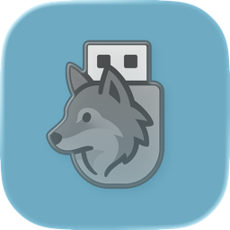

# Remus: Rufus ported to macOS

<!-- Project Logo -->
<p align="center">
  
</p>


[](https://github.com/maciejwaloszczyk/Remus/releases)
[](https://github.com/maciejwaloszczyk/Remus/releases)
[](https://www.gnu.org/licenses/gpl-3.0.en.html)
[](https://github.com/maciejwaloszczyk/Remus)
[](https://www.apple.com/macos)
[](https://github.com/maciejwaloszczyk/Remus/commits/master)

This is a macOS port of Rufus - The Reliable USB Formatting Utility.

## Architecture & Binary Availability

> [!CAUTION]
> Releases currently ship ONLY an Apple Silicon (arm64) binary. No prebuilt Intel (x86_64) binary is provided. Rosetta cannot execute arm64 code on Intel, so Intel users must compile from source.

> [!WARNING]
> Please be reminded that this is an early stage of program development, all contributions and comments are very welcome.

### Quick Overview
| Target | How to Get It |
|--------|---------------|
| arm64 (Apple Silicon) | Download release OR build from source |
| x86_64 (Intel) | Build from source (no prebuilt) |
| Universal (Fat) | Build both arches, lipo merge |

### Clone (once)
```bash
git clone https://github.com/maciejwaloszczyk/Remus.git
cd Remus/src/macos
```

### Build: Apple Silicon (arm64)
```bash
make clean
CC="clang -arch arm64 -mmacosx-version-min=11.0" make
sudo install -m 755 remus /usr/local/bin/remus
```

### Build: Intel (x86_64)
```bash
make clean
CC="clang -arch x86_64 -mmacosx-version-min=10.12" make
sudo install -m 755 remus /usr/local/bin/remus
```

### Create Universal (Fat) Binary
```bash
# arm64
make clean
CC="clang -arch arm64" make
mv remus remus-arm64
# x86_64
make clean
CC="clang -arch x86_64" make
mv remus remus-x86_64
# merge
lipo -create -output remus remus-arm64 remus-x86_64
sudo install -m 755 remus /usr/local/bin/remus
lipo -info /usr/local/bin/remus
```

### Verify
```bash
file remus
otool -hv remus | head
```

### Notes
- Adjust deployment targets as needed.
- Prefer overriding via CC / CFLAGS instead of editing the Makefile.
- GUI expects the CLI at /usr/local/bin/remus.
- Universal build is optional; single-arch is fine if you only need one platform.

Remus provides both a command-line utility and an early alpha native SwiftUI GUI for macOS that brings core Rufus functionality to the platform.

- USB device detection and enumeration
- Multiple filesystem formatting (FAT32, ExFAT, NTFS)
- Safe device identification (VID/PID, removable filtering)
- Real‑time progress feedback (GUI & CLI)
- SwiftUI GUI (alpha) with formatting & ISO write groundwork

## Features

### Currently Implemented:
- ✅ USB device detection using IOKit and DiskArbitration
- ✅ Device information display (size, vendor, product, etc.)
- ✅ Multiple filesystem support (FAT32, ExFAT, NTFS)
- ✅ Safe device validation (removable USB devices only)
- ✅ Volume labeling
- ✅ Device unmounting before formatting
- ✅ Real-time progress output (unbuffered C backend + GUI ProgressView)
- ✅ Native macOS SwiftUI GUI (alpha: formatting workflow, logging, settings, about, live progress)
- ✅ ISO image writing to USB devices (with live progress)

### In Progress / Near Term:
- 🔄 Bootable USB creation refinements
- 🔄 Extended safety & error surface polishing
- 🔄 Distribution improvements (script/installer, Homebrew formula)

### Planned (Later):
- 🔄 Additional filesystems (ext2/ext3/ext4, HFS+)
- 🔄 Advanced partitioning options
- 🔄 Notarized installer packages / helper tool

## Building

### Prerequisites:
- macOS 10.12 or later
- Xcode Command Line Tools
- GCC or Clang

### Build Instructions (CLI):

```bash
cd src/macos
make
```

### Build GUI (Xcode Project):
Open the Xcode workspace / project in `src/gui`, select the Remus target, build & run. The GUI calls the installed `remus` binary at `/usr/local/bin/remus`.

## Usage (CLI)

### List USB Devices:
```bash
remus --list
# or legacy form
remus -l
```

### Format a USB Device:
```bash
# Format disk2 as FAT32 with label "MY_USB"
sudo remus -d disk2 -f FAT32 -n MY_USB

# Format disk3 as ExFAT
sudo remus -d disk3 -f ExFAT
```

### Write an ISO:
```bash
# Write image.iso to disk2 (example flags may evolve)
sudo remus --device disk2 --write image.iso
```

### Command Line Options:
- `-l, --list`: List all USB devices
- `-d, --device DEVICE`: Select device to format (e.g., disk2)
- `-f, --filesystem TYPE`: Filesystem type (FAT32, ExFAT, NTFS)
- `-n, --name LABEL`: Volume label
- `--write <ISO>`: Write ISO image to selected device
- `-v, --verbose`: Verbose output
- `-h, --help`: Show help message

## Installation (Manual)

```bash
make install
```

This installs `remus` to `/usr/local/bin/remus`.

## Recommended Install

Install / update to latest release without cloning:
```bash
/bin/bash -c "$(curl -fsSL https://raw.githubusercontent.com/maciejwaloszczyk/Remus/master/scripts/install-remus.sh)"
```
Optional: specify a tag:
```bash
REMUS_VERSION=v0.1.0 /bin/bash -c "$(curl -fsSL https://raw.githubusercontent.com/maciejwaloszczyk/Remus/master/scripts/install-remus.sh)"
```

### Alternative Install (Release Artifacts Drag & Drop)
If the release provides both `Remus.app` and the standalone `remus` binary:

1. Download `Remus.app.zip` (or `.dmg`) and the `remus` binary (or `remus-<version>-macos-*.tar.gz`) from the Releases page.
2. Extract and drag `Remus.app` into `/Applications`.
3. Install the CLI binary:
   - If you downloaded a tarball: `tar -xf remus-<version>-macos-*.tar.gz`
   - Make it executable (if needed): `chmod +x remus`
   - Move it into PATH (may require password):
     ```bash
     sudo install -m 755 remus /usr/local/bin/remus
     # or
     sudo mv remus /usr/local/bin/remus && sudo chmod 755 /usr/local/bin/remus
     ```
4. Verify installation:
   ```bash
   remus --version
   remus --list
   ```
5. Launch the GUI from Applications (Spotlight: Remus). The GUI expects the CLI at `/usr/local/bin/remus`.

Update (when a new version is released):
```bash
sudo install -m 755 remus /usr/local/bin/remus
# then reopen Remus.app if running
```
Removal:
```bash
sudo rm -f /usr/local/bin/remus
rm -rf /Applications/Remus.app
```
Security note: Always obtain artifacts from the official GitHub Releases page.

## GUI Notes
- Alpha SwiftUI app (device list, options, progress bar, log, settings, about sheet)
- Uses a C backend with unbuffered stdout for smooth progress parsing
- If the CLI is missing, GUI will show *No USB devices found* (ensure installation)
- Planned: embedded helper or external installer packaging

## Safety Features

- Only lists and operates on removable USB devices
- Requires user confirmation before formatting (GUI & CLI confirmation safeguards)
- Validates device existence before operations
- Uses native macOS disk management APIs
- Guards against accidental system disk selection

## Used Technologies

| Layer | Tech |
|-------|------|
| Languages |   |
| GUI |  |
| macOS Frameworks |    |
| Tooling |   |
| Distribution |   |

## Technical Implementation

### Core Components:

1. **Device Detection (`macos_device.c`)**:
   - Uses IOKit to enumerate storage devices
   - Filters for removable USB devices only
   - Extracts device properties (VID/PID, size, vendor/product names)

2. **Disk / Image Operations**:
   - Uses DiskArbitration framework for device management
   - Leverages `diskutil` for formatting operations
   - Direct write workflow for ISO images with progress callbacks
   - Handles device unmounting automatically

3. **Progress & Logging**:
   - Unbuffered C stdout (setvbuf/fflush) for real-time progress lines
   - Swift Process pipe streaming & regex parsing
   - GUI log view with timestamped entries

4. **Safety Mechanisms**:
   - Multiple validation layers
   - Clear prompts / confirmations
   - Graceful error propagation to GUI & CLI

### Key macOS APIs Used:
- **IOKit**: Low-level device enumeration & property access
- **DiskArbitration**: Disk management and mount control
- **Core Foundation**: CF types & property extraction
- **SwiftUI**: Native GUI implementation (alpha)

## Differences from Windows Rufus

### Architecture Changes:
- **SwiftUI GUI** instead of Win32 dialogs (alpha stage)
- **IOKit** vs WinAPI for hardware
- **DiskArbitration / diskutil** vs DeviceIoControl / Win32 formatting
- **macOS sandbox/security considerations** vs Windows privilege model

### Current Limitations:
- Bootable creation refinement still in progress
- Limited advanced partitioning / filesystem set beyond FAT32/ExFAT/NTFS
- No notarized installer yet (manual or script install)

## Development Roadmap

### Phase 1 (Completed): ✅ Basic CLI + Core Imaging
- USB detection & enumeration
- Basic formatting support
- ISO image writing
- Core safety checks

### Phase 2 (Active): 🔄 Enhanced & GUI Integration
- Bootable USB creation flow
- GUI polish (error states, device auth nuances)
- Progress refinement & resilience

### Phase 3 (Planned): 🔄 Advanced Features
- Additional filesystems & partition schemes
- Extended format / boot options
- Automated update / installer integration (pkg / Homebrew)

### Phase 4 (Future): 🔄 Parity & Distribution
- Wider feature parity with Rufus
- Notarization, codesigning, helper tool (SMJobBless)
- Optimizations & extended hardware heuristics

## Contributing

This is a fork/port of the original Rufus project by Pete Batard.

### Original Rufus:
- Repository: https://github.com/pbatard/rufus
- Author: Pete Batard
- License: GPL v3

### Remus (macOS Port):
- Maintained by: Maciej Wałoszczyk
- License: GPL v3 (same as original)

## License

This program is free software: you can redistribute it and/or modify it under the terms of the GNU General Public License as published by the Free Software Foundation, either version 3 of the License, or (at your option) any later version.

## Acknowledgments

- Pete Batard for the original Rufus application
- The macOS developer community for IOKit and DiskArbitration documentation
- All contributors to the original Rufus project

---

⚠️ **WARNING**: This software can erase data on your drives. Use with caution and always backup important data before formatting any device.
